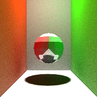
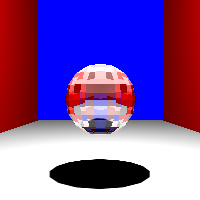

# naive-ray-tracing
A naive ray tracing for VR final project

## Features

- Naive-ray-tracing including reflection, refraction and diffuse reflection.

- Soft-shadow, transparency, half-transparency and color-bleeding.

- Using multi-process for speed up.

## Environment
- This project is build under g++ 4.9.

## Usage
There are many args to set the situation.

First we need to choose the path of the file and the file name.(It is a obj file)

Then we need to set the position of eye, light point and pixels.

Finally we can add some walls to make our scene more realistic.

Here is some pictures for display.

Because of my algorithm and the speed to raytracing, I am so sorry I couldn't render every picture clearly, and I just show some very simple picture to find some features. If you are interested in the specific scene, you feel free to download my code and improve it or test other scenes.

## Softshadow

Also, softshadow is really expensive to render.

## transparency, half-transparency. It is hard to find because the wall doesn't have texture.

It is hard to find because the wall doesn't have texture.

## color-bleeding

## other pictures

## Acknowledgement

- Thanks Professor Bin Sheng and classmates Tiancheng Xie, Yiwei Bai, Zihao Ye for their help.
